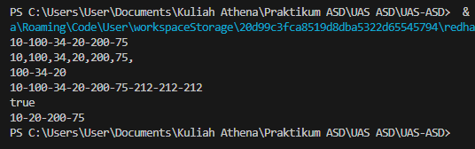

# Laporan UAS Praktikum
NIM     : 2241720023

Nama    : Athena Nurhaliza

Kelas   : TI-1C / 05

### SOAL
```java 
        //soal 1
        int[] toArray(){
            int[] array = new int[size()];
            Node2P current = head;
            int index = 0;
            while (current != null) {
                array[index] = current.data;
                current = current.next;
                index++;
            }
            return array;
        }
    
        //soal 2
        DLL sublist(int start, int end){
            DLL sublist = new DLL();
            Node2P current = head;
            int index = 0;
            while (current != null && index <= end) {
                if (index >= start) {
                sublist.addLast(current.data);
            }
            current = current.next;
            index++;
        }
            return sublist;
        }
    
        //soal 3
        void addAll(DLL list){
            Node2P current = list.head;
            while (current != null) {
            addLast(current.data);
            current = current.next;
            }
        }
    
        //soal 4
        boolean containsAll(DLL list){
            if (list == null || list.head == null) {
                return false;
            }
    
            Node2P current = list.head;
            while (current != null) {
                if (!contains(current.data)) {
                    return false;
                }
                current = current.next;
            }
    
            return true;
        }
    
        public boolean contains(int data) {
            Node2P current = head;
            while (current != null) {
                if (current.data == data) {
                    return true;
                }
                current = current.next;
            }
            return false;
        }
    
        //soal 5
        void removeAll(DLL list){
            Node2P current = list.head;
            while (current != null) {
                deleteByData(current.data);
                current = current.next;
            }
        }
```

### OUTPUT PROGRAM
